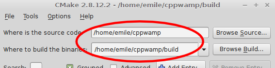
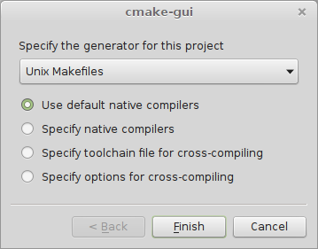
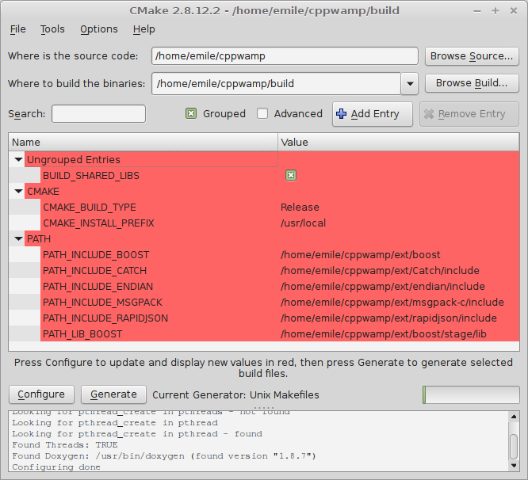

<!-- ---------------------------------------------------------------------------
                Copyright Butterfly Energy Systems 2014-2015.
         Distributed under the Boost Software License, Version 1.0.
             (See accompanying file LICENSE_1_0.txt or copy at
                    http://www.boost.org/LICENSE_1_0.txt)
---------------------------------------------------------------------------- -->

Building Library, Unit Tests, and Examples
==========================================

Dependencies
------------

### CMake

You'll need the [CMake][cmake] build system to build the CppWAMP library, unit
tests, and examples. The CMake GUI front end is also highly recommended. Both
can be installed on Debian-based systems using:

```bash
sudo apt-get install cmake cmake-qt-gui
```

### Header-Only Third-Party Libraries

The following third-party libraries are already bundled with CppWAMP as git
submodules, under the `ext` subdirectory:

- [Catch][catch] unit testing framework
- [Boost.Endian][boost-endian]
- [Rapidjson][rapidjson]
- [Msgpack-c][msgpack-c], release [1.0.0][msgpack-c-100] or greater

The above libraries are used in a header-only fashion and do not need to be
compiled.

### Boost Libraries

You'll also need the following [Boost][boost] libraries (version 1.56 or
greater):
- Boost.Asio (Header-only)
- Boost.System (Compiled)
- Boost.Coroutine (Compiled)
- Boost.Context (Compiled)

### WAMP Router

To run the unit tests and example program, you'll need a WAMP router that
supports raw socket transports. CppWAMP provides pre-made configuration files
ready to be used by the [Crossbar][crossbar] router.

### Doxygen
To generate the reference documentation, you'll need [Doxygen][doxygen]. On
Debian-based systems, it can be installed using

```bash
sudo-apt get install doxygen
```

[cmake]: http://www.cmake.org
[catch]: https://github.com/philsquared/Catch
[boost-endian]: https://github.com/boostorg/endian
[rapidjson]: https://github.com/miloyip/rapidjson
[msgpack-c]: https://github.com/msgpack/msgpack-c
[msgpack-c-100]: https://github.com/msgpack/msgpack-c/releases/tag/cpp-1.0.0
[boost]: http://www.boost.org/
[crossbar]: http://crossbar.io
[doxygen]: http://www.doxygen.org

1. Cloning CppWAMP
------------------

The following command will clone CppWAMP and its submodules, placing everything
under a `cppwamp` directory:

```bash
git clone --recursive https://github.com/ecorm/cppwamp
```

2. Building Required Boost Libraries
------------------------------------
**If you already have Boost 1.56.0 or greater installed on your system, you may
skip this step.**

The following steps will place the Boost libraries under the `cppwamp/ext`
subdirectory. Of course, you may install the Boost libraries wherever you want
on your system, as long as you tell your compiler where to find those libraries.

After cloning CppWAMP, navigate to the `cppwamp/ext` subdirectory, download the
latest Boost package, and extract it to `cppwamp/ext/boost`:

```bash
cd cppwamp/ext
wget http://downloads.sourceforge.net/project/boost/boost/1.57.0/boost_1_57_0.tar.bz2
tar xjf boost_1_57_0.tar.bz2
mv boost_1_57_0 boost
```

where `1.57.0` can be replaced by a newer version number, if available. Now go
to the extracted Boost archive and build the required Boost libraries using the
following commands:

```bash
cd boost
./bootstrap.sh --with-libraries=system,coroutine,context
./b2 -j4
```
where ``-j4` specifies a parallel build using 4 jobs. You may want to increase
or decrease the number of parallel jobs, depending on the number of cores
available on your system. If you prefer to build _all_ Boost libraries, then
leave out the `--with-libraries` option.

After building, the Boost library binaries should be available under
`cppwamp/ext/boost/stage/lib`. You can verify this by issuing:

```bash
ls stage/lib
```

3. Building CppWAMP, Unit Tests, and Examples
---------------------------------------------

Start the `cmake-gui` tool, and tell it where cppwamp was cloned, as well as the
directory where to build the binaries.



Click the _Configure_ button. When asked if it should create the build
directory, click _Yes_. cmake-gui will them prompt you for the generator to use
for this project. On Unix systems, you may choose _Unix Makefiles_ and
_Use default native compilers_. For other systems, please make the appropriate
choices.



Once the generator settings have been selected, click _Finish_. cmake-gui will
then show customizable build variables, highlighted in red. You may check the
_Grouped_ checkbox to group these variables by name:



Verify that all of the variables under `PATH` correspond to the correct
directories where the third-parties libraries are located. If you prefer to
build a static library instead of a shared library, uncheck the
`BUILD_SHARED_LIBS` checkbox.

Once you're satisfied with the build variables, click _Configure_ again.
Then click _Generate_ to generate the appropriate makefiles or compiler project.

If you had chosen to generate something other than Unix makefiles, open the
generated project using the appropriate tool or IDE.

If you had chosen to generate Unix makefiles, open a terminal and go to the
build directory that you specified in cmake-gui. Then issue the `make` command
to start building the CppWAMP library:

```bash
cd path/to/cppwamp/build
make -j4
```

where the `-j` option lets you specify the number of parallel build jobs on
multi-core systems.

If successful, you should see the following output:
```
Scanning dependencies of target cppwamp
[  4%] [ 13%] [ 13%] [ 17%] Building CXX object cppwamp/CMakeFiles/cppwamp.dir/src/error.cpp.o
Building CXX object cppwamp/CMakeFiles/cppwamp.dir/src/client.cpp.o
Building CXX object cppwamp/CMakeFiles/cppwamp.dir/src/asiotransport.cpp.o
Building CXX object cppwamp/CMakeFiles/cppwamp.dir/src/legacytransport.cpp.o
Linking CXX shared library libcppwamp.so
[ 17%] Built target cppwamp
Scanning dependencies of target chat
Scanning dependencies of target test
[ 21%] Building CXX object examples/chat/CMakeFiles/chat.dir/main.cpp.o
[ 26%] [ 30%] [ 34%] Building CXX object test/CMakeFiles/test.dir/codectestmsgpack.cpp.o
Building CXX object test/CMakeFiles/test.dir/codectestjson.cpp.o
Building CXX object test/CMakeFiles/test.dir/legacytransporttest.cpp.o
[ 39%] Building CXX object test/CMakeFiles/test.dir/transporttest.cpp.o
Linking CXX executable chat
[ 39%] Built target chat
[ 43%] Building CXX object test/CMakeFiles/test.dir/varianttestassign.cpp.o
[ 47%] Building CXX object test/CMakeFiles/test.dir/varianttestbadaccess.cpp.o
[ 52%] Building CXX object test/CMakeFiles/test.dir/varianttestcomparison.cpp.o
[ 56%] Building CXX object test/CMakeFiles/test.dir/varianttestconvert.cpp.o
[ 60%] Building CXX object test/CMakeFiles/test.dir/varianttestinfo.cpp.o
[ 65%] Building CXX object test/CMakeFiles/test.dir/varianttestinit.cpp.o
[ 69%] Building CXX object test/CMakeFiles/test.dir/varianttestmap.cpp.o
[ 73%] Building CXX object test/CMakeFiles/test.dir/varianttestoutput.cpp.o
[ 78%] Building CXX object test/CMakeFiles/test.dir/varianttesttuple.cpp.o
[ 82%] Building CXX object test/CMakeFiles/test.dir/varianttestvector.cpp.o
[ 86%] Building CXX object test/CMakeFiles/test.dir/varianttestvisitation.cpp.o
[ 91%] Building CXX object test/CMakeFiles/test.dir/wamptest.cpp.o
[ 95%] Building CXX object test/CMakeFiles/test.dir/wamptestargs.cpp.o
[100%] Building CXX object test/CMakeFiles/test.dir/main.cpp.o
Linking CXX executable test
[100%] Built target test
```

The compiled binaries will be located at these locations:

- `build/cppwamp/libcppwamp.so` for the shared library
- `build/test/test` for the unit test executable
- `build/test/examples` for the example program executables

where `build` corresponds to the build directory you chose in cmake-gui.

If you have Doxygen installed, you may also generate the reference
documentation with:

```bash
make doc
```

The generated documentation will be located under `build/doc`, where `build`
corresponds to the build directory you chose in cmake-gui.


4. Adding Compiler and Linker Options To Your Program
-----------------------------------------------------

After you have built CppWAMP and its dependencies, you may use it in your
programs by using the following compiler flags:

- `-std=c++11` (for GCC and Clang compilers)
- `-DCPPWAMP_COMPILED_LIB`
- `-Ipath/to/cppwamp/cppwamp/include`
- `-Ipath/to/cppwamp/ext/boost`
- `-Ipath/to/cppwamp/ext/endian/include`
- `-Ipath/to/cppwamp/ext/msgpack-c/include`
- `-Ipath/to/cppwamp/ext/rapidjson/include`

as well as the following linker flags:

- `-Lpath/to/cppwamp/build/cppwamp`
- `-Lpath/to/cppwamp/ext/boost/stage/lib`
- `-lcppwamp`
- `-lboost_coroutine`
- `-lboost_context`
- `-lboost_system`

Note that `-lboost_coroutine` and `-lboost_context` are not required if you're
not using the coroutine-based client API.

If you prefer to use CppWAMP as a header-only library, please use these
[options](./usingheaderonly.md/headeronlyopts) instead.

5. Running Unit Tests
---------------------

A WAMP router is required to run all test cases. CppWAMP already provides the
`config.json` file necessary to run the Crossbar router with the necessary
configuration. To use Crossbar, open a new terminal and go to the pre-made
Crossbar node directory. Then start the Crossbar router:

```bash
cd path/to/cppwamp/build/test
crossbar start
```

In a separate terminal, run test suite executable:

```bash
cd path/to/cppwamp/build/test
./test
```

If successful, you should see the following output:

```
All tests passed (37351 assertions in 51 test cases)
```


6. Running The Example Programs
-------------------------------

A WAMP router is required to run the example programs. CppWAMP already provides
the `config.json` file necessary to run the Crossbar router with the necessary
configuration. To use Crossbar, open a new terminal and go to the pre-made
Crossbar node directory. Then start the Crossbar router:

```bash
cd path/to/cppwamp/build/examples
crossbar start
```

In a separate terminal, run the desired example program:

```bash
cd path/to/cppwamp/build/examples/chat
./chat
```
